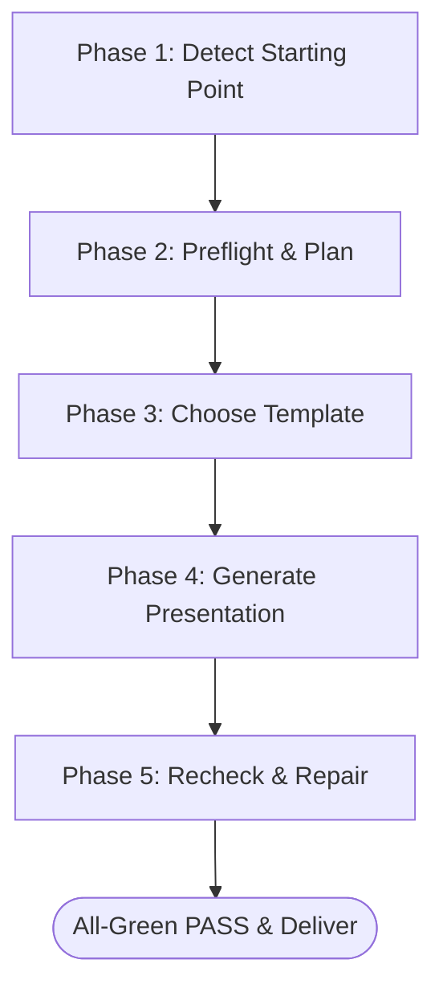

# 🎬 presentation-feature-video-ads

One-command skill pack for turning briefs, product pages, or empty projects into code-ready presentations, pitch decks, product demos, launch sequences, and video ads.

```bash
npx skills add Rommadon/presentation-video-ads-skill
```

Built to integrate seamlessly with **Codex**, **Claude Code**, **OpenCode**, **Cursor**, and any agent that reads skill folders.

---

## 💎 Core Philosophy & Delivery Promises

Unlike standard slide decks, this skill builds interactive, high-fidelity, **motion-heavy** and **text-light** cinematic video ads and presentations directly inside your codebase.

*   **⚡ Zero-Dependency HTML Delivery**  
    Generates single-file standalone HTML presentations containing inline styling/logic, or utilizing the bundled shared player library (`lib/player.js` & `lib/player.css`). No node modules, build configs, or external CDNs required.
*   **🎥 Motion-Heavy, Text-Light Storytelling**  
    Focuses on micro-scenes with one communication job, one focal object, and one active visible UI state. Text overlays and cards fade gracefully to keep attention centered.
*   **📱 Mobile-Native Dual Aspect**  
    Builds and optimizes layouts natively for both **16:9** (desktop/widescreen) and **9:16** (mobile/shorts).
*   **🔍 Closed Recheck Pass**  
    Delivery is gated by a rigorous per-scene render QA ledger. Every scene must log a `16:9 PASS` and `9:16 PASS` verify stamp before handoff.
*   **📂 Progressive Disclosure**  
    Maintains a light, markdown-first folder structure. Load only what is needed, when it is needed.

---

## 🎨 Visual Starter Templates

Choose a design authority based on the product context and desired tone. Explore the visual previews before loading full designs:

| Template | Tone & Use Case | Visual Characteristics | Links |
| :--- | :--- | :--- | :--- |
| **✨ Feature Core** | **Strongest adaptive default** for product-marketing | Clean UI mockups, layered reveals, varied motion | [Preview](templates/presentation-feature-core/preview.md) / [Design](templates/presentation-feature-core/design.md) |
| **✍️ Soft Editorial** | Warm, literary, or magazine presentation flow | Warm paper stock, serif typography, calm surfaces | [Preview](templates/soft-editorial/preview.md) / [Design](templates/soft-editorial/design.md) |
| **🌿 Emerald** | Confident, high-contrast corporate presentations | Deep emerald + navy tones, bold masthead, stat walls | [Preview](templates/emerald-editorial/preview.md) / [Design](templates/emerald-editorial/design.md) |
| **🌌 Vellum** | Dark, atmospheric, scholarly reflection | Dark vellum background, sparse copy, slow motion | [Preview](templates/vellum/preview.md) / [Design](templates/vellum/design.md) |
| **💊 Capsule** | Playful, card-based SaaS features | Rounded cards, card-group layouts, upbeat steps | [Preview](templates/capsule/preview.md) / [Design](templates/capsule/design.md) |
| **🌐 Cobalt Grid** | High-structure analytical research | Precise grid geometry, crisp technical layouts | [Preview](templates/cobalt-grid/preview.md) / [Design](templates/cobalt-grid/design.md) |

---

## 🔄 The Progressive Disclosure Workflow

The skill guides developers and AI agents through a clean, multi-phase progressive disclosure workflow:



1.  **Phase 1: Detect** — Scans the current project workspace to build either a standalone presentation or thin framework/route integrations.
2.  **Phase 2: Preflight & Plan** — Resolves product facts and constraints. If the input is sufficient, it asks zero questions. For unresolved choices, it asks a maximum of 2–4 recommendation-first selectable questions. It then drafts an **input-derived micro-scene inventory**.
3.  **Phase 3: Select** — References `reference/STYLE_INDEX.md` and shortlists templates using lightweight preview cards without bulk-reading design files.
4.  **Phase 4: Generate** — Creates the zero-dependency HTML using the modular `lib/player.js` engine, orchestrating entrance, action, and exit animations.
5.  **Phase 5: Recheck & Repair** — Runs a closed per-scene recheck pass. A ledger is maintained where every scene must verify `16:9 PASS` and `9:16 PASS` before release.

---

## 🛠️ Code Showcase

The skill outputs standard, clean, zero-dependency HTML using the custom `PresentationPlayer` library. Here is an example of what is generated:

```html
<!doctype html>
<html lang="en">
<head>
  <meta charset="utf-8" />
  <meta name="viewport" content="width=device-width, initial-scale=1" />
  <title>Product Presentation</title>
  <link rel="stylesheet" href="lib/player.css" />
  <style>
    /* Premium scene-bound animations */
    .scene { font-family: system-ui; text-align: center; }
    .scene h1 { opacity: 0; transform: translateY(20px); transition: 0.6s ease; }
    .scene.active h1 { opacity: 1; transform: translateY(0); }
  </style>
</head>
<body>
  <div id="player"></div>

  <script src="lib/player.js"></script>
  <script>
    new PresentationPlayer(document.getElementById('player'), {
      scenes: [
        {
          id: 'scene-1',
          duration: 5000,
          html: '<div class="scene"><h1>Zero-Dependency HTML Delivery</h1></div>',
          activate: (el) => el.querySelector('.scene').classList.add('active')
        }
      ]
    });
  </script>
</body>
</html>
```

---

## 📂 Repository Layout

```text
presentation-feature-video-ads/
├── README.md              # Beautiful Landing Page (this file)
├── SKILL.md               # Workflow Map for compatible agents
├── manifest.json          # Machine-readable skill metadata
├── docs/                  # Detailed output and contract specifications
│   ├── OUTPUT-CONTRACT.md # Zero-dependency & aspect requirements
│   └── USAGE.md           # Quick usage & examples guide
├── reference/             # Shared styling and layout authority files
│   ├── STYLE_INDEX.md     # Fast template chooser
│   ├── STYLE_GUIDE.md     # Design language contract
│   └── PRODUCT_PILLARS.md # Delivery promises and rules
├── templates/             # Starter design templates
│   ├── index.json         # Lightweight metadata chooser
│   └── */preview.md       # Visual previews for choice selection
└── lib/                   # The Core Presentation Engine
    ├── player.js          # Interactive player script
    └── player.css         # Baseline player styling layout
```

---

## 🧪 Development and Testing

The repository includes a suite of architecture tests to guarantee portability, alignment, and adherence to the product pillars:

```bash
# Run the architectural tests
node tests/architecture.test.mjs
```

---

<div align="center">
  <sub>Built for the modern AI pairing era. Clean design, zero overhead.</sub>
</div>
